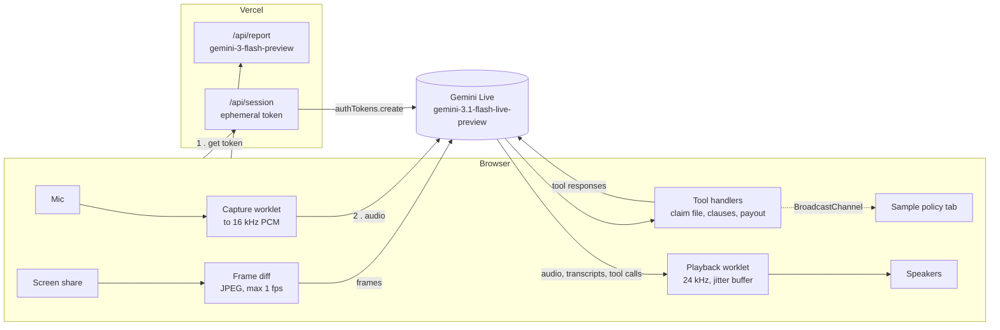

# Covered

**A live voice assistant for insurance policies and claims.** Describe what happened in plain speech, show your policy on screen, and hear a clear answer grounded in the actual clause, not a wall of text.

Built on the **Gemini Live API** (`gemini-3.1-flash-live-preview`) for the NSOffice AI Centre of Excellence assignment, idea #2: *Live Policy and Claims Voice Assistant (BFSI / Insurance)*.

**Live demo:** https://network-science-task.vercel.app

---

## What it does

- **Real-time voice, both ways.** Audio streams to Gemini over a WebSocket as you speak, and the reply streams back as audio. You can talk over it at any point: playback stops immediately and it answers what you just said.
- **Reads the policy on your screen.** Share the tab or window with your policy document. Before it explains what your policy says, the assistant pins the clause it is relying on, **word for word**, so you can check it.
- **Points at the clause.** With the bundled sample policies, the cited clause scrolls into view and lights up in the shared tab, so you and the model are looking at the same thing.
- **Builds the claim file while you talk.** Policy number, who was treated, dates, hospital, amounts: each detail is captured through tool calls mid-conversation. The tool reply tells the model what is still missing, so its next question is the useful one.
- **Coverage view and an exact payout estimate.** The model decides which rules apply (room-rent limits, deductibles, co-payment, depreciation, caps) and the app does the arithmetic, with a step-by-step breakdown.
- **Hand-off note for the claims desk.** When the call ends, `gemini-3-flash-preview` turns the transcript and captured data into a structured summary with flags and open questions. You can download it as a PDF.
- **Speaks your language.** English, Hindi, Hinglish, Marathi… it replies in whatever the caller uses. Amounts are in rupees with Indian digit grouping.
- **Privacy by default.** It never asks for Aadhaar, PAN, bank or card numbers. Anything that looks like one is scrubbed before it is stored or sent on for the report.

## Try it in a minute

1. Open the live demo in **Chrome or Edge on a laptop**. Headphones give the cleanest barge-in.
2. Under *No policy to hand?*, open **Kestrel CarePlus** (a specimen health policy) in a new tab.
3. Go back to Covered, click **Start a call** and allow the microphone.
4. Click **Share screen** and pick the policy tab.
5. Say something like:
   > "My husband Vikram was admitted for dengue for three days. He took a deluxe room at ₹8,000 a day and the bill is ₹1,80,000. How much will you pay?"
6. Watch clause 3.6 light up in the policy tab, the claim file fill in, and the payout get worked out. Interrupt it whenever you like.
7. Click **End call** to get the hand-off note.

Other things to try: *"I need kidney stone surgery next month, can I claim?"* (24-month waiting period), or switch to the **Kestrel DriveSure** motor policy: *"I drove through a flooded underpass and the engine won't start."* (Engine Protect not opted.)

## How it works



### Decisions worth calling out

**The API key never reaches the browser.** Serverless functions can't hold a WebSocket open, so the browser has to talk to Gemini directly. `/api/session` mints a single-use [ephemeral token](https://ai.google.dev/gemini-api/docs/ephemeral-tokens) (one minute to open a session, 30 minutes of life) and locks the **model, system prompt and tools into the token** with `liveConnectConstraints`. A leaked token can only talk to this assistant.

**Grounding is a tool, not a hope.** The system prompt requires `cite_clause` before explaining the policy, with the exact wording from the screen. Every quote the answer rests on is visible in the UI and in the hand-off note, so a human can check it.

**The model reasons, the code calculates.** Language models are unreliable at multi-step money maths. `estimate_payout` receives the rules the model chose (for example "proportionate deduction, ₹5,000 eligible vs ₹8,000 charged, applied to ₹96,000 of room-linked charges") and `src/live/payout.ts` computes the result exactly.

**Barge-in that feels natural.** Audio plays through an `AudioWorklet` queue. The moment Gemini reports `interrupted`, the queue is dropped: no half-sentence trailing off from a buffer. Interrupted turns are marked in the transcript.

**Frames are only sent when the screen changes.** A policy document mostly sits still while people talk about it. Each second the app compares a 96×54 grayscale thumbnail with the last frame it *sent*, and only sends a new JPEG when you scroll, zoom or switch pages (plus a keyframe every 15 s). The UI shows how many frames were sent and skipped.

**Long calls don't fall over.** Audio + video sessions are capped at about two minutes unless context compression is on, so the session uses a sliding window. Connections are also recycled about every ten minutes; the app listens for `goAway`, keeps the latest session-resumption handle, fetches a fresh token with the handle baked in, and resumes the same conversation.

**One accent colour.** The NSOffice brand uses Electric Blue as its only accent, so coverage verdicts use a three-step meter and icons instead of red/amber/green.

## Run it locally

You need **Node.js 20 or newer** and a free Gemini API key from [Google AI Studio](https://aistudio.google.com/apikey) (no billing required).

```bash
git clone https://github.com/sehscape/NetworkScienceTask.git
cd NetworkScienceTask
npm install
cp .env.example .env
```

Open `.env` and paste your key after `GEMINI_API_KEY=` (on Windows PowerShell use `copy .env.example .env`). Then start the dev server:

```bash
npm run dev
```

Open **http://localhost:5173** in Chrome or Edge.

`npm run dev` serves the frontend **and** the `/api` routes. A small Vite plugin in `vite.config.ts` mounts the same handlers Vercel runs, so you don't need the Vercel CLI.

| Command             | What it does                                        |
| ------------------- | --------------------------------------------------- |
| `npm run dev`       | Dev server with hot reload and the API routes       |
| `npm run build`     | Type-check, then build the static site into `dist/` |
| `npm run preview`   | Serve the built frontend (no API routes)            |
| `npm run typecheck` | TypeScript only                                     |

## Environment variables

| Variable            | Required | Default                         | Purpose                                                  |
| ------------------- | -------- | ------------------------------- | -------------------------------------------------------- |
| `GEMINI_API_KEY`    | yes      | none                            | Server-side only. Used to mint tokens and write reports. |
| `GEMINI_LIVE_MODEL` | no       | `gemini-3.1-flash-live-preview` | Real-time voice + screen model                           |
| `GEMINI_TEXT_MODEL` | no       | `gemini-3-flash-preview`        | Post-call hand-off note                                  |
| `GEMINI_VOICE`      | no       | `Kore`                          | Prebuilt voice for the assistant                         |
| `GEMINI_TEXT_FALLBACKS` | no   | `gemini-3.1-flash-lite,gemini-flash-latest` | Tried in order if the text model is out of quota or overloaded |

`.env` is git-ignored. Only `.env.example` is committed.

## Deploy to Vercel

1. Import the repository at [vercel.com/new](https://vercel.com/new). Vercel detects Vite and the `api/` folder automatically, so no build settings are needed.
2. In **Settings → Environment Variables**, add `GEMINI_API_KEY`.
3. Deploy. Every push to `main` redeploys.

## Project structure

```
api/
  session.ts            POST: ephemeral Live API token with config locked in
  report.ts             POST: post-call hand-off note (structured JSON output)
  _lib/
    live-config.ts      system prompt, tool declarations, session config
    gemini.ts           client factory, model names
    http.ts             JSON helpers, same-origin guard, error mapping
shared/
  types.ts              types shared by the browser and the API
public/worklets/
  capture-processor.js  mic to 16 kHz PCM16 on the audio thread
  playback-processor.js streaming 24 kHz playback with instant flush
src/
  live/
    live-call.ts        one call: session, mic, speaker, screen, reconnects
    case-tools.ts       tool handlers (pure functions over the case state)
    payout.ts           deterministic payout calculator
    screen-share.ts     display capture with change detection
  audio/                mic capture and PCM player wrappers
  components/           home, call and summary views and their cards
  hooks/                React bindings for the call and the sample viewer
  policies/             specimen health and motor policy wordings
  viewer/               the shareable policy viewer (policy.html)
  design/               NSOffice glass UI: tokens.css, liquid-glass.js
  styles/               global, app and policy viewer styles
```

## Limitations

- Best in **Chrome or Edge on desktop**. Phones can't share their screen from a browser; voice still works.
- Clause highlighting only works with the bundled sample policies, which share the app's origin. With your own PDF, the assistant still reads and cites the clause; it just can't scroll your PDF viewer.
- The free tier allows only about 20 `gemini-3-flash-preview` requests per day per project. When that runs out (or the model reports high demand), the hand-off note falls back to lighter Flash models, and the summary shows which model wrote it.
- `gemini-3.1-flash-live-preview` only supports blocking function calls, so the model waits for each tool reply. All handlers run locally and return instantly, so the pause isn't noticeable.
- This is guidance, not a claim decision. **Kestrel General Insurance is fictional** and the specimen policies were written for this demo.

## Built with

React 19, TypeScript, Vite, the [`@google/genai`](https://www.npmjs.com/package/@google/genai) SDK and the Web Audio API. No UI component library; the interface follows the NSOffice glass UI system (DM Sans, Electric Blue, one primary action per view).
