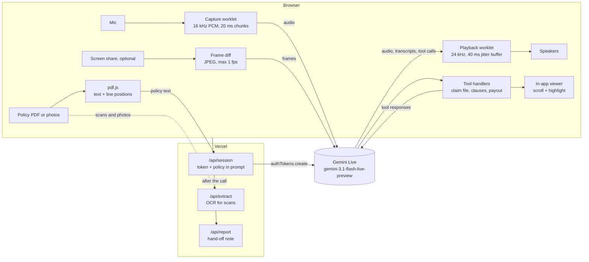

# Covered

**A live voice assistant for insurance policies and claims.** Describe what happened in plain speech, in your own language, with your policy open beside you, and hear a clear answer grounded in the actual clause, not a wall of text.

Built on the **Gemini Live API** (`gemini-3.1-flash-live-preview`) for the NSOffice AI Centre of Excellence assignment, idea #2: *Live Policy and Claims Voice Assistant (BFSI / Insurance)*.

**Live demo:** https://network-science-task.vercel.app

---

## What it does

- **Real-time voice, both ways.** Audio streams to Gemini over a WebSocket as you speak, and the reply streams back as audio. Talk over it at any point: playback stops immediately and it answers what you just said.
- **Upload the whole policy.** Drop in a PDF, a scanned PDF or phone photos of each page. Text PDFs are read in the browser with pdf.js; scans and photos are read with Gemini. The full wording goes to the assistant, so it can answer from any page.
- **Read it without leaving the call.** The policy opens in a viewer right inside the call screen. Scroll and zoom it yourself, and when the assistant cites a clause, the viewer scrolls to it and highlights it: *"I've highlighted clause 3.6 for you."*
- **Or share your screen.** For a policy that isn't a file (an insurer portal, an email), share a tab or window and the assistant reads it live.
- **Every answer shows its source.** Before it explains your policy, the assistant pins the clause it relies on, **word for word**, so you can check it.
- **Any Indian language, detected automatically.** It works out the language from your voice and replies in the same one: English, Hindi, Hinglish, Marathi, Tamil, Telugu, Bengali and more. Switch mid-call and it switches too. The detected language is shown live.
- **Fast.** The first audio of a reply typically starts about 0.7 s after you stop talking, and a live meter in the call screen shows the actual reply time.
- **Builds the claim file while you talk.** Policy number, who was treated, dates, hospital, amounts: each detail is captured through tool calls during the conversation. The tool reply tells the model what is still missing, so its next question is the useful one.
- **Coverage view and an exact payout estimate.** The model decides which rules apply (room-rent limits, deductibles, co-payment, depreciation, caps) and the app does the arithmetic, with a step-by-step breakdown.
- **Hand-off note for the claims desk.** When the call ends, `gemini-3-flash-preview` turns the transcript and captured data into a structured summary with flags, open questions and the languages used. Download it as a PDF.
- **Privacy by default.** It never asks for Aadhaar, PAN, bank or card numbers. Anything that looks like one is scrubbed before it is stored or sent on for the report.

## Try it in a minute

1. Open the live demo in **Chrome or Edge on a laptop**. Headphones give the cleanest barge-in.
2. On the right of the home screen, click **Health** under *Try a specimen* (or drop in your own policy PDF).
3. Click **Start a call** and allow the microphone.
4. Ask, in any language, something like:
   > "My husband Vikram was admitted for dengue for three days. He took a deluxe room at ₹8,000 a day and the bill is ₹1,80,000, of which ₹96,000 is room charges. How much will you pay?"
5. Watch the policy scroll to clause 3.6 and light up, the claim file fill in, and the payout get worked out. Interrupt whenever you like.
6. Click **End call** to get the hand-off note.

More to try: *"मुझे अगले महीने किडनी स्टोन की सर्जरी करानी है, क्लेम मिलेगा?"* (24-month waiting period), or load the **Motor** specimen and ask *"I drove through a flooded underpass and the engine won't start."* (Engine Protect not opted.)

## How it works



### Decisions worth calling out

**The API key never reaches the browser.** Serverless functions can't hold a WebSocket open, so the browser talks to Gemini directly. `/api/session` mints a single-use [ephemeral token](https://ai.google.dev/gemini-api/docs/ephemeral-tokens) and locks the **model, system prompt, tools and the caller's policy text into the token** with `liveConnectConstraints`. A leaked token can only talk to this assistant.

**The whole policy goes in once, as text.** An uploaded policy is converted to text with page markers and baked into the session's system prompt, which stays out of the sliding context window. A policy uploaded mid-call is sent into the live session straight away. The assistant can then quote any page exactly, without the caller having to scroll to the right place first.

**Highlighting the clause in the caller's copy.** pdf.js gives every line of text with its position on the page. When the assistant calls `cite_clause`, `src/docs/locate.ts` finds the clause by its number at the start of a line (falling back to the quoted words), and the viewer scrolls there and draws the highlight band. If the clause can't be found, nothing is highlighted rather than the wrong thing.

**Latency, measured rather than guessed.** I timed each change against the live API, measuring from the moment the caller stops speaking to the first audio of the reply:

| Change | Effect on first audio |
| --- | --- |
| Model speaks a short acknowledgement first, then calls tools; record-keeping tools go at the end of the turn | ~2.0 s → **~0.7 s** |
| Policy sent once as text, instead of page images during the call | page images added ~1.9 s to the next reply |
| Voice detection left on Gemini's defaults | aggressive end-of-speech settings cut callers off at every pause without real gains |
| `thinkingLevel: minimal`, 20 ms mic chunks, 40 ms playback buffer | small, steady savings |
| Token fetched on hover over *Start a call*; mic permission and WebSocket handshake run in parallel | call connects noticeably faster |

The call screen shows the measured reply time for every turn, and the hand-off note records the median.

**Grounding is a tool, not a hope.** The system prompt requires `cite_clause` whenever the assistant says what the policy says, with the exact wording. Every quote the answer rests on is visible in the UI and in the hand-off note.

**The model reasons, the code calculates.** Language models are unreliable at multi-step money maths. The assistant is told never to say an amount that didn't come from `estimate_payout`; `src/live/payout.ts` does the arithmetic from the rules the model chose (for example "proportionate deduction, ₹5,000 eligible vs ₹8,000 charged, applied to ₹96,000 of room-linked charges").

**Barge-in that feels natural.** Audio plays through an `AudioWorklet` queue. The moment Gemini reports `interrupted`, the queue is dropped: no half-sentence trailing off from a buffer. Interrupted turns are marked in the transcript.

**Long calls don't fall over.** Audio + video sessions use a sliding context window, and the app listens for `goAway`, keeps the latest session-resumption handle, fetches a fresh token with the handle baked in, and resumes the same conversation.

**Preview models are slow sometimes.** The hand-off note and OCR use a *hedged* request (`api/_lib/hedge.ts`): the preferred model starts first, and if it hasn't answered in a few seconds (or runs out of free quota), the next model starts in parallel. The first answer wins.

**NSOffice design system.** Colours, type, radii, borders and shadows are taken from nsoffice.ai: Electric Blue `#1200FF` as the only accent, DM Sans, white and lavender surfaces, the fading headline treatment, and one primary action per screen (*Start a call*, *End call*, *Download PDF*). Tokens live in `src/design/tokens.css`.

## Run it locally

You need **Node.js 20 or newer** and a free Gemini API key from [Google AI Studio](https://aistudio.google.com/apikey) (no billing required).

```bash
git clone https://github.com/sehscape/NetworkScienceTask.git
cd NetworkScienceTask
npm install
cp .env.example .env
```

Open `.env` and paste your key after `GEMINI_API_KEY=` (on Windows PowerShell use `copy .env.example .env`). Then start the dev server:

```bash
npm run dev
```

Open **http://localhost:5173** in Chrome or Edge.

`npm run dev` serves the frontend **and** the `/api` routes. A small Vite plugin in `vite.config.ts` mounts the same handlers Vercel runs, so you don't need the Vercel CLI.

| Command             | What it does                                        |
| ------------------- | --------------------------------------------------- |
| `npm run dev`       | Dev server with hot reload and the API routes       |
| `npm run build`     | Type-check, then build the static site into `dist/` |
| `npm run preview`   | Serve the built frontend (no API routes)            |
| `npm run typecheck` | TypeScript only                                     |

## Environment variables

| Variable                | Required | Default                                     | Purpose                                                   |
| ----------------------- | -------- | ------------------------------------------- | --------------------------------------------------------- |
| `GEMINI_API_KEY`        | yes      | none                                        | Server-side only. Mints tokens, writes reports, runs OCR. |
| `GEMINI_LIVE_MODEL`     | no       | `gemini-3.1-flash-live-preview`             | Real-time voice + screen model                            |
| `GEMINI_TEXT_MODEL`     | no       | `gemini-3-flash-preview`                    | Post-call hand-off note                                   |
| `GEMINI_TEXT_FALLBACKS` | no       | `gemini-3.1-flash-lite,gemini-flash-latest` | Tried if the text model is slow or out of quota           |
| `GEMINI_VOICE`          | no       | `Kore`                                      | Prebuilt voice for the assistant                          |

`.env` is git-ignored. Only `.env.example` is committed.

## Deploy to Vercel

1. Import the repository at [vercel.com/new](https://vercel.com/new). Vercel detects Vite and the `api/` folder automatically, so no build settings are needed.
2. In **Settings → Environment Variables**, add `GEMINI_API_KEY`.
3. Deploy. Every push to `main` redeploys. (After changing an environment variable, redeploy once so it takes effect.)

## Project structure

```
api/
  session.ts            POST: ephemeral Live API token, with prompt, tools and policy locked in
  report.ts             POST: post-call hand-off note (structured JSON output)
  extract.ts            POST: OCR for scanned PDFs and photos of a policy
  _lib/
    live-config.ts      system prompt, tool declarations, session config
    hedge.ts            try the preferred model, start a fallback if it's slow
    gemini.ts           client factory, model names
    http.ts             JSON helpers, same-origin guard, error mapping
shared/
  types.ts              types shared by the browser and the API
public/
  samples/              specimen health and motor policies as PDFs
  worklets/             mic capture and streaming playback on the audio thread
src/
  live/
    live-call.ts        one call: session, mic, speaker, screen, latency, language, reconnects
    case-tools.ts       tool handlers (pure functions over the case state)
    payout.ts           deterministic payout calculator
    screen-share.ts     display capture with change detection
  docs/
    load.ts             PDFs, scans and photos into text the model can use
    pdf.ts              pdf.js: text with line positions, page rendering
    locate.ts           find a cited clause on the page
  audio/                mic capture and PCM player wrappers
  components/           home, call and summary views, policy viewer and cards
  hooks/                React bindings for the call and the loaded policy
  lib/                  formatting, language detection, PII scrubbing
  policies/             source of the specimen policy wordings
  viewer/               standalone policy page (policy.html), handy for screen-share demos
  design/               NSOffice glass UI: tokens.css, liquid-glass.js
  styles/               global, app and policy page styles
```

## Limitations

- Best in **Chrome or Edge on desktop**. Phones can't share their screen from a browser; voice, upload and the in-app viewer still work.
- Clause highlighting needs a PDF with a text layer. For scans and photos the text is read with OCR, so the assistant can still quote the clause, and the viewer highlights the right page rather than the exact lines.
- The free tier allows only about 20 `gemini-3-flash-preview` requests per day per project. When that runs out, or the model is slow, the hand-off note and OCR fall back to lighter Flash models, and the summary shows which model wrote it.
- `gemini-3.1-flash-live-preview` only supports blocking function calls, so the model pauses briefly while a tool runs. The handlers are local and instant, and the prompt has the assistant speak before using tools, so the caller is rarely left waiting.
- This is guidance, not a claim decision. **Kestrel General Insurance is fictional** and the specimen policies were written for this demo.

## Built with

React 19, TypeScript, Vite, the [`@google/genai`](https://www.npmjs.com/package/@google/genai) SDK, pdf.js and the Web Audio API. No UI component library.
