<div align="center">

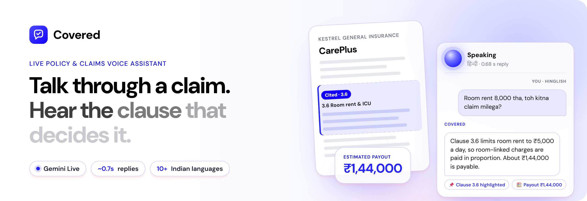

<br />

**A real-time voice assistant for insurance policies and claims.**<br />
Speak in any Indian language, keep your policy open beside you, and hear a clear answer grounded in the exact clause.

<br />

[](https://network-science-task.vercel.app)


[**Try it**](#-try-it-in-a-minute) · [**How it works**](#-how-it-works) · [**Latency**](#-latency-measured-not-guessed) · [**Run locally**](#-run-it-locally) · [**Project structure**](#-project-structure)

</div>

---

> Built for the **NSOffice AI Centre of Excellence** internship assignment, idea #2: *Live Policy and Claims Voice Assistant (BFSI / Insurance)*. It uses the Gemini Live API (`gemini-3.1-flash-live-preview`) for the real-time conversation and `gemini-3-flash-preview` for the post-call hand-off note, both on the free tier.

<div align="center">
  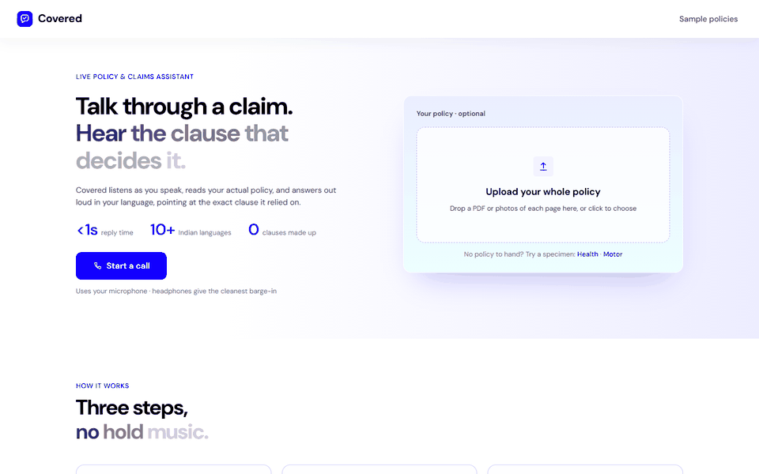
  <br />
  <sub>A real call, recorded in the browser: the caller asks a question, the assistant highlights clause 3.6 in the policy, works out the payout, and writes the hand-off note.</sub>
</div>

## 📊 At a glance

<div align="center">

| ⚡ First audio | 🌐 Languages | 📄 Policy input | 🧰 Live tools | 🔐 API keys in the browser |
| :---: | :---: | :---: | :---: | :---: |
| **~0.7 s** after you stop talking | **10+**, detected from your voice | **PDF · scan · photos · screen** | **5**, called mid-conversation | **0**, single-use tokens only |

</div>

## ✨ Highlights

<table>
<tr>
<td width="33%" valign="top">

### 🎙️ Real-time voice
Audio streams to Gemini over a WebSocket while you speak, and the answer streams back as speech. Talk over it at any time: playback stops instantly and it answers what you just said.

</td>
<td width="33%" valign="top">

### 📄 The whole policy, in the call
Upload a PDF, a scan or phone photos. The full wording goes to the assistant, and the policy opens in a viewer **inside the call screen**. No switching tabs.

</td>
<td width="33%" valign="top">

### 📌 Points at the clause
When the assistant explains your policy, it cites the clause **word for word**, and the viewer scrolls to it and highlights it.

</td>
</tr>
<tr>
<td valign="top">

### 🌐 Your language, automatically
Hindi, Hinglish, Marathi, Tamil, Telugu, Bengali, English and more. It replies in the language of your latest sentence and switches when you do.

</td>
<td valign="top">

### 🧮 Maths done by code
The model picks which policy rules apply; a deterministic calculator does the arithmetic and rejects incomplete inputs, so you never hear a guessed number.

</td>
<td valign="top">

### 🗂️ Hand-off for the claims desk
The claim file fills itself in as you talk. When you hang up, you get a structured summary with flags and open questions, ready to download as a PDF.

</td>
</tr>
</table>

## 🖼️ Screens

<table>
<tr>
<td width="50%">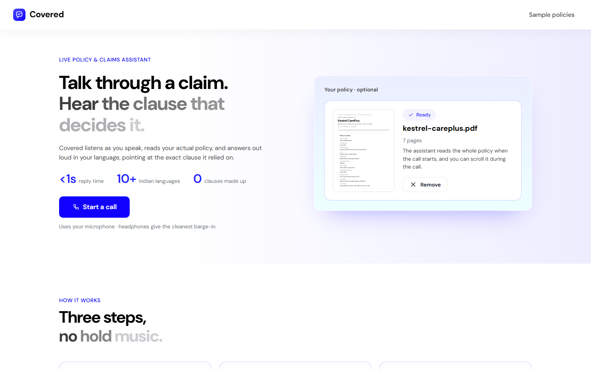<br /><sub><b>Home</b>: one primary action, with the policy upload beside it.</sub></td>
<td width="50%">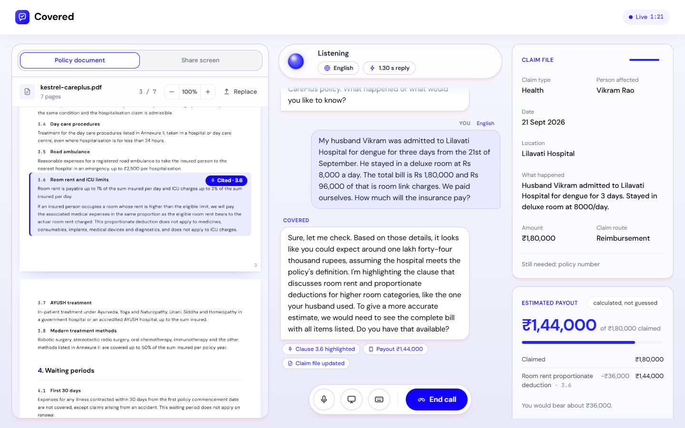<br /><sub><b>Live call</b>: policy viewer, conversation and case file side by side.</sub></td>
</tr>
<tr>
<td width="50%">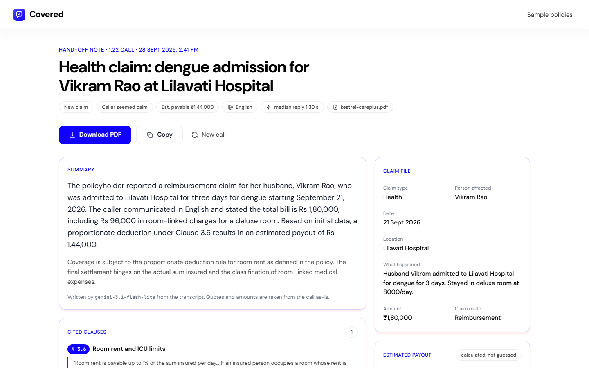<br /><sub><b>Hand-off note</b>: written after the call, with every quote and amount taken from the call itself.</sub></td>
<td width="50%" align="center">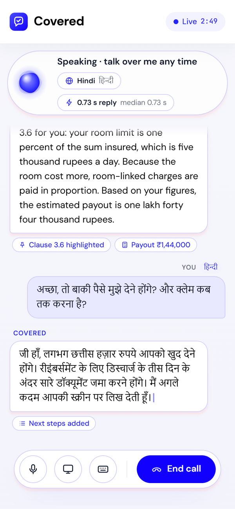<br /><sub><b>On a phone</b>: the conversation scrolls, the controls stay in reach.</sub></td>
</tr>
</table>

## 🚀 Try it in a minute

1. Open **[network-science-task.vercel.app](https://network-science-task.vercel.app)** in Chrome or Edge on a laptop. Headphones give the cleanest barge-in.
2. Under *No policy to hand?*, click **Health** to load a specimen policy, or drop in your own PDF.
3. Click **Start a call** and allow the microphone.
4. Ask, in any language:
   > *"My husband Vikram was admitted for dengue for three days. He took a deluxe room at ₹8,000 a day and the bill is ₹1,80,000, of which ₹96,000 is room charges. How much will you pay?"*
5. Watch clause 3.6 light up in the policy, the claim file fill in, and **₹1,44,000** appear as the estimate.
6. Click **End call** for the hand-off note.

<details>
<summary><b>More things to try</b></summary>

| Say this | What should happen |
| --- | --- |
| *"मुझे अगले महीने किडनी स्टोन की सर्जरी करानी है, क्लेम मिलेगा?"* | Replies in Hindi, cites the 24-month waiting period (clause 4.2) |
| *"Room rent 8,000 tha, toh kitna claim milega?"* | Replies in Hinglish and works out the proportionate deduction |
| Load **Motor**, then: *"I drove through a flooded underpass and the engine won't start."* | Cites exclusion 5.4: Engine Protect wasn't opted |
| *"Will making a claim affect my no claim bonus?"* | Cites clause 7.1 |
| Talk over the assistant mid-sentence | It stops at once; the cut-off reply is marked *interrupted* |

</details>

## 🧠 How it works

### System overview

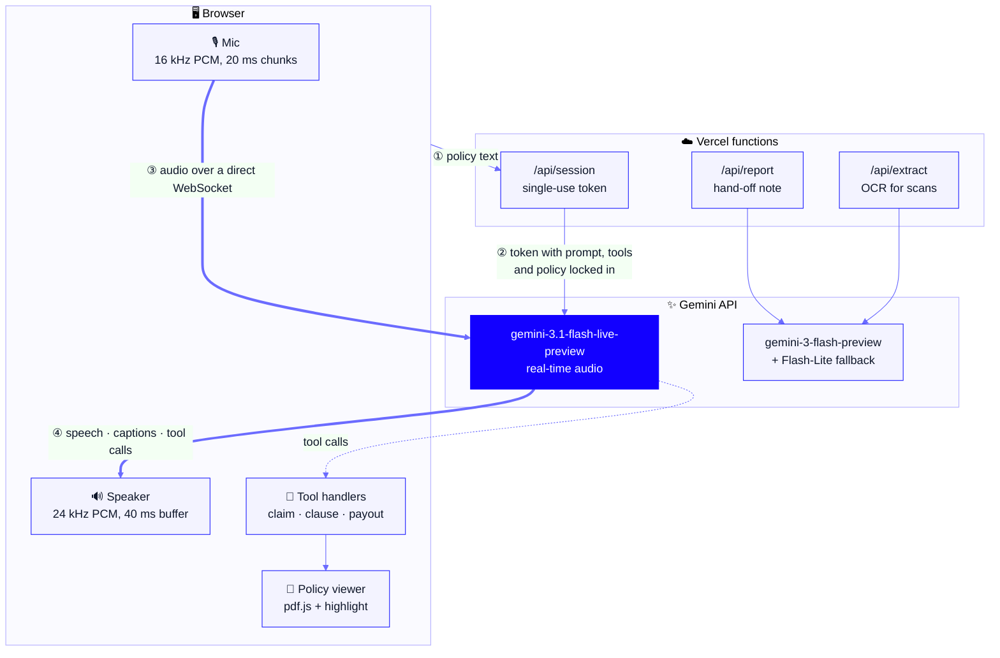

The browser talks to Gemini **directly** over a WebSocket: serverless functions can't hold a socket open, and it removes a hop from every audio packet. The API key never leaves the server. `/api/session` hands the browser a short-lived, single-use token with the model, system prompt, tools and your policy locked inside it.

### One turn of the conversation

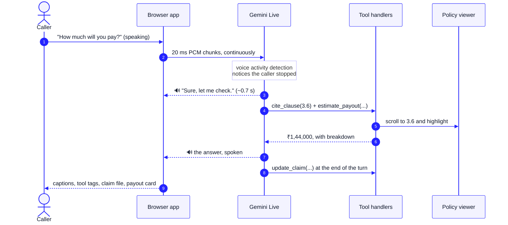

### Getting the policy into the conversation

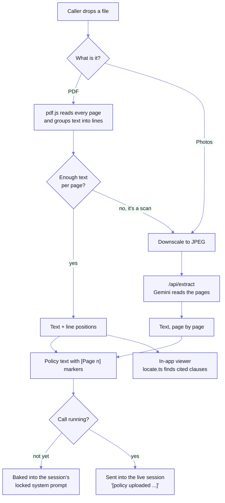

### Call lifecycle

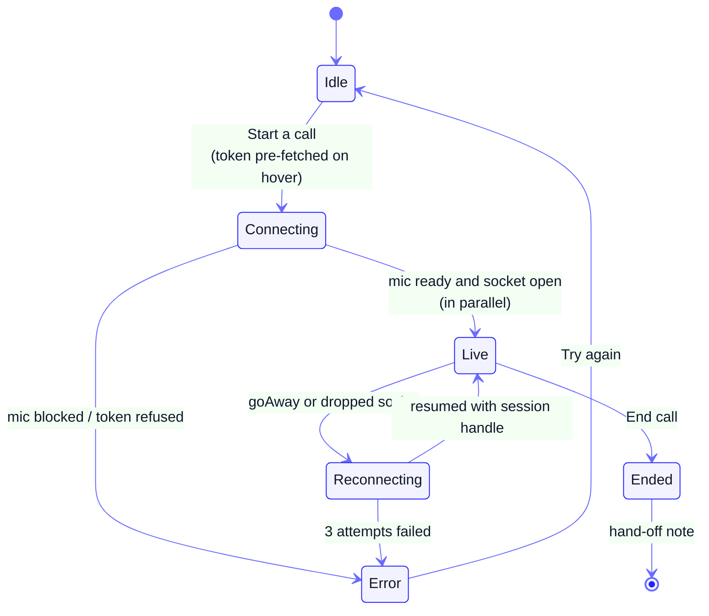

## ⚡ Latency, measured not guessed

<div align="center">
  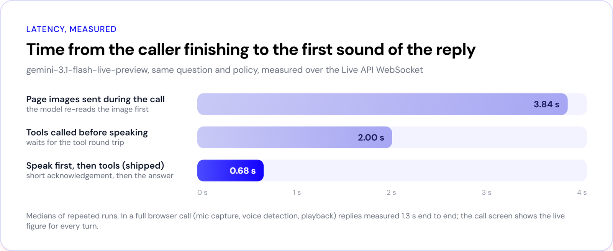
</div>

Every change below was timed against the live API, from the moment the caller stops speaking to the first audio of the reply.

| Change | Why | Effect |
| --- | --- | --- |
| 🗣️ **Speak first, then use tools** | 3.1 Flash Live only has blocking tools; calling them first left the caller in silence | **~2.0 s → ~0.7 s** |
| 📄 **Policy sent once, as text** | page images made the model re-read an image before answering | removed a ~1.9 s penalty |
| 🎚️ **Gemini's default voice detection** | tighter end-of-speech settings cut people off at every pause | no false turn-taking |
| 🧠 **`thinkingLevel: minimal`** | a voice reply doesn't need deliberation | lower time to first token |
| 🎧 **20 ms mic chunks, 40 ms playback buffer** | less audio sitting in buffers | smaller, steady savings |
| 🔥 **Token fetched on hover, mic + socket in parallel** | the click only has to open the WebSocket | call connects sooner |

The call screen shows the measured reply time for every turn, and the hand-off note records the median. In a full browser call (mic capture, voice detection, playback) replies measured about **1.3 s end to end**.

## 🧰 What the assistant can do mid-call

| Tool | When the model calls it | What you see |
| --- | --- | --- |
| `cite_clause` | before saying what the policy says | clause pinned word for word, viewer scrolls to it and highlights it |
| `estimate_payout` | whenever money is involved | payout card with a step-by-step breakdown |
| `assess_coverage` | once there's enough to judge | covered / partly covered / not covered, with reasons |
| `update_claim` | at the end of a turn, with anything new | claim file fields fill in, with a progress bar |
| `set_next_steps` | before the call wraps up | ordered next steps, documents list and deadline |

`update_claim` replies with the fields still missing, so the assistant's next question is the useful one. `estimate_payout` rejects inputs that don't add up (a per-day limit passed as a cap, a partial bill) and tells the model what to fix, rather than showing a wrong figure.

<details>
<summary><b>Example: how a payout is worked out</b></summary>

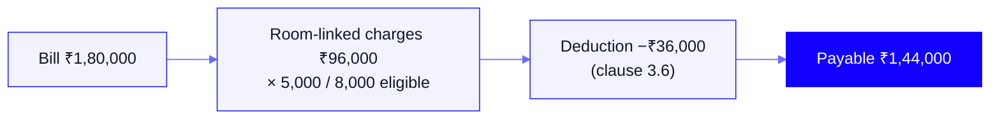

The model chooses the rule and the figures; `src/live/payout.ts` does the arithmetic.

</details>

## 🌐 Languages

The language is worked out from the caller's voice, not picked from a menu. Each turn is answered in the language of the caller's most recent sentence, and the call screen shows what it heard.

| Language | Example | Script |
| --- | --- | --- |
| English | *"Are we covered?"* | Latin |
| Hindi | *"क्या यह कवर होगा?"* | Devanagari |
| Hinglish | *"Kitna claim milega?"* | Latin |
| Marathi | *"क्लेम मिळेल का?"* | Devanagari |
| Tamil | *"இது கவர் ஆகுமா?"* | Tamil |
| Telugu, Bengali, Gujarati, Kannada, Malayalam, Punjabi, Urdu | | own scripts |

Clause quotes stay exactly as written in the policy; the explanation is in the caller's language. The hand-off note is always in English and records which languages were used.

## 🔐 Security and privacy

- **No key in the browser.** Tokens are single-use, must be opened within 60 seconds, and are locked to this assistant's model, prompt and tools.
- **Same-origin fence.** The API routes refuse cross-site requests, so other websites can't mint tokens against the key.
- **No sensitive numbers.** The assistant never asks for Aadhaar, PAN, bank or card numbers, and anything that looks like one is scrubbed before it's stored or sent for the report.
- **Guidance, not decisions.** The assistant says when something depends on the insurer, and never promises approval.

## 🎨 Design system

The UI follows the NSOffice glass design system, with values taken from nsoffice.ai.

| Token | Value | Used for |
| --- | --- | --- |
|  Electric Blue | `#1200FF` | the one primary action per screen |
|  Active blue | `#2424FF` | active tabs, figures, highlights |
|  Ink blue | `#0000EF` | section labels, links |
|  Lavender | `#F3F3FF` | icon tiles, caller bubbles |
|  Ink | `#0F172A` | body text |
| Type | **DM Sans** 400–700 | everything, with JetBrains Mono for clause numbers |
| Cards | 16 px radius, `0.67px rgba(0,0,239,.18)` border, soft pink shadow | panels and cards |

One primary action per screen: **Start a call** → **End call** → **Download PDF**. Tokens live in [`src/design/tokens.css`](src/design/tokens.css).

## 💻 Run it locally

You need **Node.js 20+** and a free Gemini API key from [Google AI Studio](https://aistudio.google.com/apikey) (no billing needed).

```bash
git clone https://github.com/sehscape/NetworkScienceTask.git
cd NetworkScienceTask
npm install
cp .env.example .env
```

Put your key after `GEMINI_API_KEY=` in `.env` (on Windows PowerShell: `copy .env.example .env`), then:

```bash
npm run dev
```

Open **http://localhost:5173** in Chrome or Edge. `npm run dev` serves the app **and** the `/api` routes: a small Vite plugin mounts the same handlers Vercel runs, so you don't need the Vercel CLI.

| Command | What it does |
| --- | --- |
| `npm run dev` | Dev server with hot reload and the API routes |
| `npm run build` | Type-check, then build into `dist/` |
| `npm run preview` | Serve the built frontend (no API routes) |
| `npm run typecheck` | TypeScript only |

### Environment variables

| Variable | Required | Default | Purpose |
| --- | :---: | --- | --- |
| `GEMINI_API_KEY` | ✅ | | Server-side only: tokens, reports, OCR |
| `GEMINI_LIVE_MODEL` | | `gemini-3.1-flash-live-preview` | Real-time voice model |
| `GEMINI_TEXT_MODEL` | | `gemini-3-flash-preview` | Hand-off note |
| `GEMINI_TEXT_FALLBACKS` | | `gemini-3.1-flash-lite,gemini-flash-latest` | Used when the text model is slow or out of quota |
| `GEMINI_VOICE` | | `Kore` | Assistant voice |

`.env` is git-ignored; only `.env.example` is committed.

### Deploy to Vercel

1. Import the repo at [vercel.com/new](https://vercel.com/new). Vite and the `api/` folder are detected automatically.
2. Add `GEMINI_API_KEY` under **Settings → Environment Variables**.
3. Deploy. Every push to `main` redeploys. After changing a variable, redeploy once.

## 🗂️ Project structure

```text
api/
├── session.ts          POST  single-use Live token: prompt, tools and policy locked in
├── extract.ts          POST  OCR for scanned PDFs and photos
├── report.ts           POST  post-call hand-off note (structured JSON)
└── _lib/
    ├── live-config.ts        system prompt, tool declarations, session config
    ├── hedge.ts              preferred model first, fallback started if it's slow
    ├── gemini.ts             client factory and model names
    └── http.ts               JSON helpers, same-origin fence, error mapping
src/
├── live/
│   ├── live-call.ts          one call: session, audio, latency, language, reconnects
│   ├── case-tools.ts         tool handlers, pure functions over the case state
│   ├── payout.ts             deterministic payout calculator
│   └── screen-share.ts       screen capture that only sends changed frames
├── docs/
│   ├── load.ts               PDFs, scans and photos → text the model can use
│   ├── pdf.ts                pdf.js: text with line positions, page rendering
│   └── locate.ts             find a cited clause on the page
├── components/               home, call, summary, policy viewer, cards
├── hooks/                    React bindings for the call and the loaded policy
├── audio/                    mic capture and PCM playback wrappers
├── lib/                      formatting, language detection, PII scrubbing
├── design/                   NSOffice tokens.css and liquid-glass.js
└── styles/                   global, app and policy-page styles
public/
├── samples/                  specimen health and motor policies (PDF)
└── worklets/                 audio-thread capture and playback
shared/types.ts               types shared by the browser and the API
```

## 🧪 How it was tested

- **Live API harness.** Scripted sessions against the real API: policy in the prompt, a Hindi typed question, a spoken question (synthesised speech streamed as 16 kHz PCM), mid-call upload, and latency with and without tools and page images.
- **Full browser runs.** Headless Edge with a WAV file as the microphone, running the whole path (mic worklet, resampling, WebSocket, playback, tool calls, viewer highlight and hand-off note) locally and against the live deployment.
- **Layout checks.** The call screen was rendered with a long bilingual conversation at 1920×1080, 1440×900, 1366×768, 1280×720, 1024×768 and 390×844, with an automated check for overlapping elements.
- **Unit checks.** Payout maths and its guards, clause location by number and by quote, and language detection for Hindi, Marathi, Hinglish, English and Tamil.

## ⚠️ Limitations

- Best in **Chrome or Edge on desktop**. Phones can't share their screen from a browser; voice, upload and the viewer still work.
- Exact-line highlighting needs a PDF with a text layer. For scans and photos the text comes from OCR, so the assistant still quotes the clause, and the viewer highlights the right page.
- The free tier allows about 20 `gemini-3-flash-preview` requests a day. When that runs out or the model is slow, the hand-off note and OCR move to lighter Flash models automatically, and the note shows which model wrote it.
- Live models are probabilistic: the assistant usually cites the clause and uses the calculator, but not on every single turn.
- This is guidance, not a claim decision. **Kestrel General Insurance is fictional**, and the specimen policies were written for this demo.

<div align="center">
<br />

**Built with** React 19 · TypeScript · Vite · `@google/genai` · pdf.js · Web Audio API · Vercel

<sub>No UI component library: every screen follows the NSOffice glass design system.</sub>

</div>
